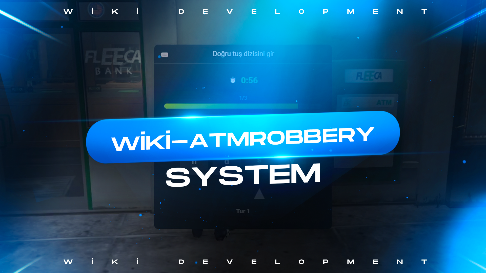

# wiki-dashcam

## in-game showroom
https://www.youtube.com/watch?v=MHg_pJ4fmH8



## Usage
```lua
Config.ATMMinigame = {
    TotalRounds = 3,              -- How many rounds must be completed for success?
    SequenceLength = 4,           -- How many key combinations per round?
    StartTimer = 60,              -- Total time (seconds)
    StabilityMax = 100,           -- Maximum value of the green bar
    StabilityDrainPerSec = 1.2,   -- How much does the bar decrease per second?
    CorrectGain = 6,              -- How much does the bar increase when you press the correct key?
    WrongPenalty = 12             -- How much does the bar decrease when you press the wrong key?
}

Config.MinReward = 250              -- Minimum cash
Config.MaxReward = 600              -- Maximum cash
Config.Cooldown = 120               -- Before the same player tries again (seconds)
```
